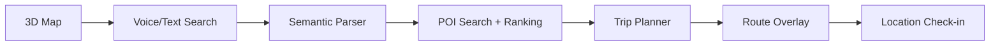

# AITravelApp MVP Architecture

## Product Loop



## Current App Layers

- `TravelHomeViewModel` owns the feature state and coordinates map, search, trip and check-in flows.
- `TravelMapView` is a MapKit adapter that provides 3D camera pitch, buildings, POI annotations and route overlays.
- `SemanticSearchService` converts natural language into `ParsedTravelQuery` and asks the API client for ranked places.
- `TripPlanningService` picks 3-6 stops and orders them by nearest-neighbor routing for the first version.
- `CheckInDetector` evaluates active trip stops locally using category-specific radius thresholds.

## Backend Contract Target

The app is ready to swap `MockTravelAPIClient` for a real client:

```http
GET /v1/pois?bbox=minLng,minLat,maxLng,maxLat&zoom=14&categories=attraction,restaurant
POST /v1/ai/search
POST /v1/trips/plan
POST /v1/checkins
```

The LLM should only parse user intent and produce structured constraints. Real POI, hours, routes and distances should come from provider APIs or the backend database.
